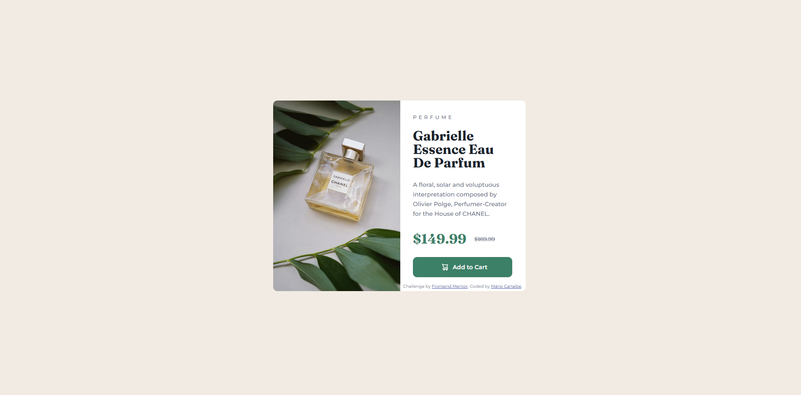
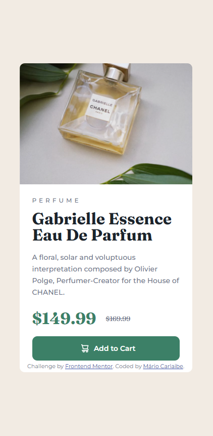

# Frontend Mentor - Solução de componente de cartão de pré-visualização de produto

Esta é uma solução para o [Desafio de componente de cartão de pré-visualização de produto no Frontend Mentor](https://www.frontendmentor.io/challenges/product-preview-card-component-GO7UmttRfa). Os desafios do Frontend Mentor ajudam você a melhorar suas habilidades de codificação ao criar projetos realistas.

## Índice

- [O desafio](#o-desafio)
- [Captura de tela](#captura-de-tela)
- [Links](#links)
- [Meu processo](#meu-processo)
- [Construído com](#construído-com)
- [O que aprendi](#o-que-aprendi)
- [Desenvolvimento contínuo](#desenvolvimento-continuo)
- [Recursos úteis](#recursos-úteis)
- [Autor](#autor)
- [Agradecimentos](#agradecimentos)

### O desafio

Os usuários devem ser capazes de:

- Visualizar o layout ideal dependendo do tamanho da tela do dispositivo
- Ver estados de foco e foco para elementos interativos

### Captura de tela

### Links

- URL da solução: [https://www.frontendmentor.io/solutions/soluo-de-componente-de-carto-de-pr-visualizao-de-produto-_T9pz8LXsE](https://www.frontendmentor.io/solutions/soluo-de-componente-de-carto-de-pr-visualizao-de-produto-_T9pz8LXsE)
- URL do site ativo: [https://mariocarlaibe.github.io/product-preview-card-component-main/](https://mariocarlaibe.github.io/product-preview-card-component-main/)

## Meu processo

### Criado com

- Marcação HTML5 semântica
- Propriedades personalizadas CSS
- Flexbox
- Fluxo de trabalho mobile-first

### O que aprendi

Pela primeira vez utilizei o método mobile first. Aprendi que é mais simples do que imaginei. 
Aprendi que as vezes é melhor usar um background-image no CSS do que o img no HTML. Para fazer alterações no responsivo é melhor.

### Desenvolvimento contínuo

Pretendo continuar a melhorar as tecnicas de flex-box, para organizar melhor os elementos dentro dos containers.

### Recursos úteis

- ChatGPT - essa ferramenta me ajudou a relembrar alguns conceitos que estava me esquecendo, e acabou que me ensinou alguns novos.

## Autor

- Site - [Mário Carlaibe](https://github.com/MarioCarlaibe)
- Mentor de front-end - [@MarioCarlaibe](https://www.frontendmentor.io/solutions/soluo-de-componente-de-carto-de-pr-visualizao-de-produto-_T9pz8LXsE)

## Agradecimentos

Agradeço ao DevQuest pelas instruções dadas que me possibilitaram chegar até aqui.